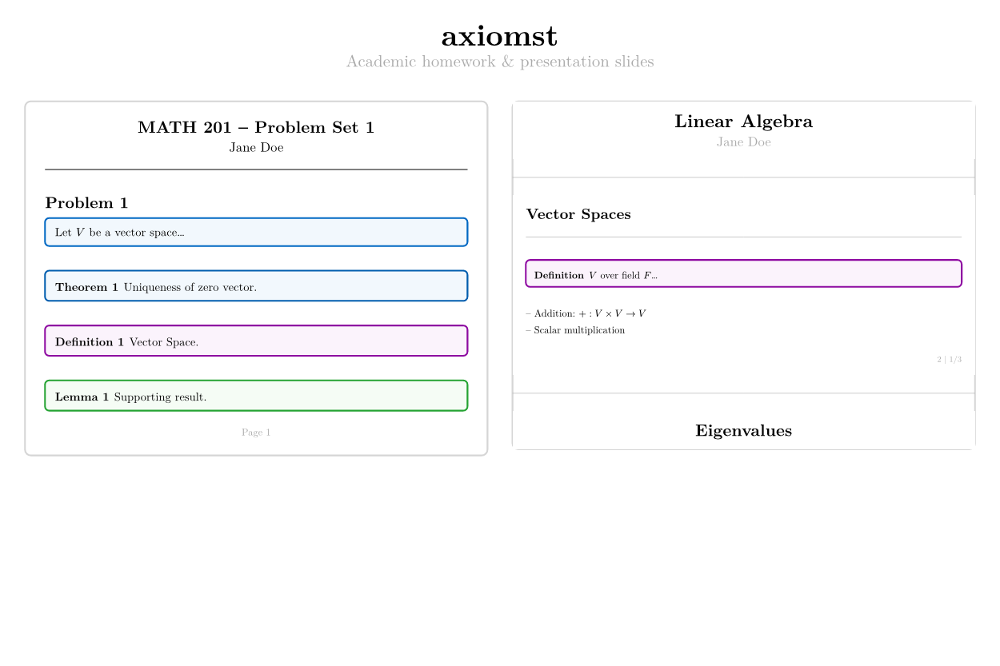

# axiomst
<div align="center">
    <figure>
        
    </figure>
</div>

A clean, elegant template for academic homework and presentation slides in [Typst](https://typst.app/).

## Features

### Homework Template
- Professional problem set layout with title page
- Automatic problem numbering
- Theorem, lemma, definition, corollary, and example boxes
- Proof blocks with customizable QED symbols
- Versioned problem sets: questions, answers, or worked solutions
- Page headers and footers with automatic numbering

### Slides Template
- Minimal, clean presentation slides
- Support for 16:9 and 4:3 aspect ratios
- Dynamic content with `pause`, `uncover`, and `only`
- Title slides and section slides
- Handout mode for print-friendly output

## Quick Start
```sh
typst init @preview/axiomst:0.3.0
```

Or import directly:

```typst
#import "@preview/axiomst:0.3.0": *
```

## Homework Usage
```typst
#import "@preview/axiomst:0.3.0": *

#show: homework.with(
  title: "Problem Set 1",
  author: "Your Name",
  course: "MATH 101",
  email: "name@uni.com",
  date: datetime.today(),
  collaborators: ("Alice", "Bob"),
  version: "solutions",
)

#problem(
  title: "Vector Spaces",
  answer: [
    Use the vector space axioms to prove uniqueness and cancellation.
  ],
  solution: [
    Suppose there are two zero vectors $0$ and $0'$.
    Since $0$ is a zero vector, $0 + 0' = 0'$.
    Since $0'$ is a zero vector, $0 + 0' = 0$.
    Hence $0 = 0'$.
  ],
)[
  Let $V$ be a vector space over a field $F$. Prove the following:
  1. The zero vector $0_V$ is unique.
  2. For each $v in V$, the additive inverse $-v$ is unique.
]

#theorem(title: "Uniqueness of Zero")[
  In any vector space $V$, the zero vector is unique.
]

#proof[
  Suppose there exist two zero vectors...
]
```

### Homework Options
| Parameter | Description | Default |
|-----------|-------------|---------|
| `title` | Assignment title | "Homework Assignment" |
| `author` | Your name | "Student Name" |
| `course` | Course code/name | "Course Code" |
| `email` | Your email | - |
| `date` | Submission date | `datetime.today()` |
| `due-date` | Due date (optional) | `none` |
| `collaborators` | List of collaborators | `[]` |
| `version` | Output version: `"questions"`, `"answers"`, or `"solutions"` | `"solutions"` |
| `problem-label` | Default label for numbered problems | `[Problem]` |
| `answer-label` | Default answer label, including punctuation | `[Answer:]` |
| `solution-label` | Default solution label, including punctuation | `[Solution:]` |

### Academic Elements
- `theorem(title: "", numbered: true)[...]`
- `lemma(title: "", numbered: true)[...]`
- `definition(title: "", numbered: true)[...]`
- `corollary(title: "", numbered: true)[...]`
- `example(title: "", numbered: true)[...]`
- `proof(title: [Proof.], qed-symbol: "fill")[...]`
- `problem(title: "", numbered: true, label: auto, answer-label: auto, solution-label: auto, answer: none, solution: none)[...]`

Problem versions:
- `version: "questions"` - questions only
- `version: "answers"` - questions plus `answer`, falling back to `solution`
- `version: "solutions"` - questions plus `solution`

Custom labels can be set for the whole homework:

```typst
#show: homework.with(
  problem-label: [Uppgift],
  answer-label: [Svar:],
  solution-label: [Lösning:],
)
```

They can also be overridden for one problem. Strings and content values are both accepted, and answer and solution labels are rendered with exactly the punctuation supplied:

```typst
#problem(
  label: "Övning",
  answer-label: [Kort svar --],
  solution-label: "Fullständig lösning:",
  answer: [The short answer.],
  solution: [The worked solution.],
)[
  The question.
]
```

## Slides Usage
```typst
#import "@preview/axiomst:0.3.0": *

#show: slides.with(
  title: "My Presentation",
  author: "Your Name",
  date: datetime.today(),
  ratio: "16-9",  // or "4-3"
  handout: false,
)

#title-slide(
  title: "My Presentation",
  subtitle: "A Subtitle",
  author: "Your Name",
  institution: "University",
  date: datetime.today(),
)

#slide(title: "First Slide")[
  Content here.

  #pause

  This appears on the next subslide.
]

#slide(title: "Dynamic Content")[
  #uncover(1)[Visible from start]
  #uncover((from: 2))[Appears on subslide 2+]
  #only(3)[Only on subslide 3]
]

#section-slide[New Section]
```

### Slides Options
| Parameter | Description | Default |
|-----------|-------------|---------|
| `title` | Presentation title | "Presentation" |
| `author` | Presenter name | `none` |
| `date` | Date | `datetime.today()` |
| `ratio` | Aspect ratio | `"16-9"` |
| `handout` | Handout mode (no subslides) | `false` |
| `margin` | Page margin | `1.5cm` |

### Dynamic Content
- `#pause` - Content after this appears on the next subslide
- `#uncover(indices)[...]` - Show content on specified subslides (layout preserved)
- `#only(indices)[...]` - Show content on specified subslides (affects layout)

Index formats:
- Single: `1`, `2`, `3`
- Array: `(1, 3)` - subslides 1 and 3
- Range: `(from: 2)` - subslide 2 onwards

## Shared Components
Both templates have access to:

- `columns(count: 2, gutter: 1em)[...][...]` - Multi-column layout
- `pfigure(image-path: "", caption: "")` - Centered figure
- `ptable(content, caption: "")` - Centered table
- `instructions[...]` - Instruction block

## License
MIT License - see [LICENSE](LICENSE) for details.
